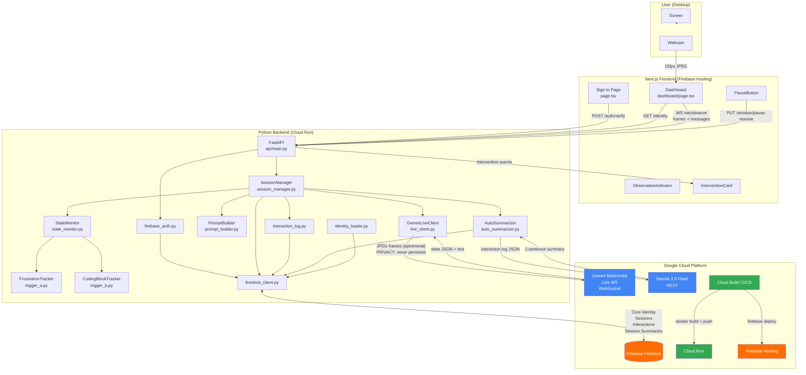

# Project Rumi — System Architecture

## Data Flow: Ephemeral vs Persisted

| Data | Path | Persisted? |
|------|------|-----------|
| Video frames | Webcam → Frontend → Backend → Gemini WebSocket | **Never** — ephemeral only |
| State analysis | Gemini → StateMonitor (in-memory) | **Never** |
| Intervention text | Gemini → InterventionCard | Only the text, in Firestore |
| Interaction Summary | Backend → Firestore `interactions/` | ✅ Text only |
| Session Summary | AutoSummarizer → Firestore `session_summaries/` | ✅ 2 sentences |
| Core Identity | Firestore `users/` | ✅ Seeded once |

## Key Architectural Decisions

1. **Single Gemini Live WebSocket** per session — avoids reconnect latency; preserves context
2. **Ephemeral frame processing** — OpenCV → base64 → WebSocket → discarded; zero disk/DB writes
3. **Firestore sub-collection hierarchy** — `users/{uid}/sessions/{sid}/interactions/{iid}` + `users/{uid}/session_summaries/{sum}`
4. **AutoSummarizer uses Gemini 2.0 Flash** (non-streaming) — Live API session closed at end; Flash is cheaper and sufficient
5. **Trigger A priority** over Trigger B when both fire simultaneously — Trigger B deferred to next 45s cycle
