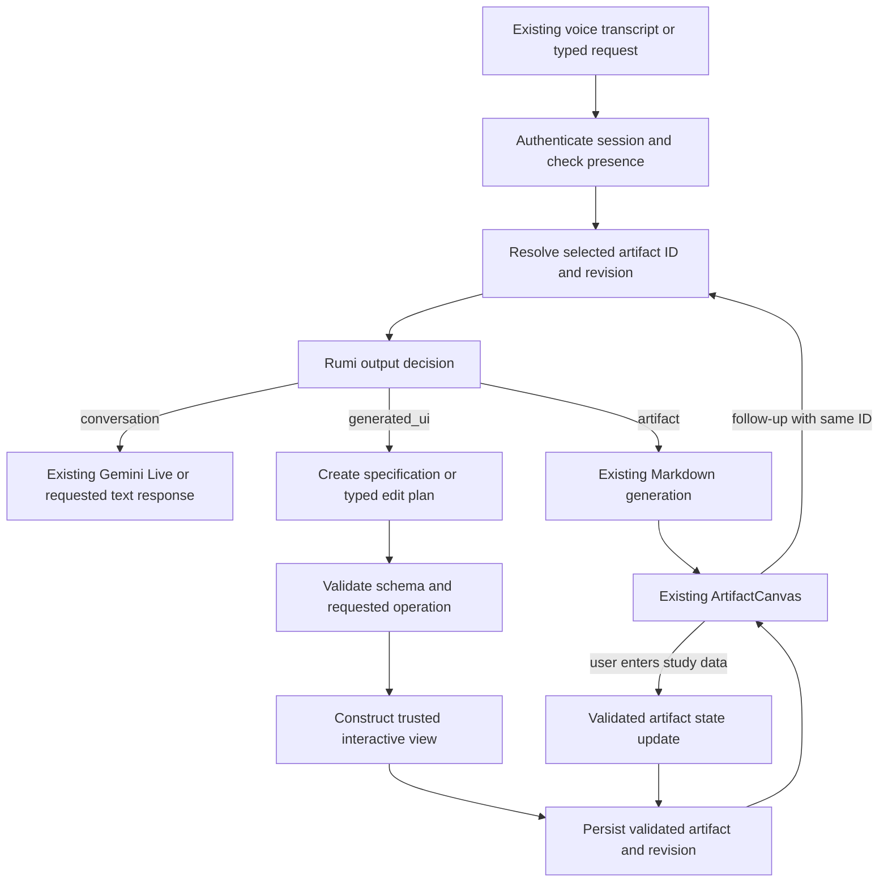

# Rumi CREATE layer: Morph OS source audit and extraction plan

Date: 19 September 2026. Status: investigation and proposal only; implementation requires approval.

**Recommendation:** absorb Morph's explicit intent classification and plan/execution separation into Rumi, but replace its execution and validation boundaries. Start with a schema-driven interactive study tracker rendered by trusted React inside the existing Artifact Canvas. Follow with general generated React only after a separate runtime passes isolation tests.

## Audit scope and evidence

| Codebase | Verified location | Revision inspected | Working tree at inspection |
| --- | --- | --- | --- |
| Rumi | `F:/mirrat` | `2f5bf982351ada997bd78ac25645257143e46403` | Clean |
| Morph OS | `F:/morph_os` | `f728769c8b88827bc4058b9ad57f21e20fabd329` | Clean |

Morph's Git remote is `harisawan27/morph_os`. A separate `F:/morph-os` directory exists but has no Git repository; only its top-level inventory was checked to distinguish it from the source repository. Its implementation was not mixed into this audit. No other historical project's source was inspected.

This report comes from tracing source, call sites, dependency manifests, the installed `react-runner` implementation, persistence code, and relevant tests. No model calls, generated applications, database mutations, deployments, or production changes were made. Findings about reachable browser privileges are static security conclusions, not claims of a completed penetration test. Model identifiers below are strings configured in source, not verified statements about provider availability. Timings written in Morph comments or UI are not benchmarks.

## 1. Rumi Current Output Architecture

### Request and session path

The Next.js dashboard owns camera/screen capture, browser speech recognition, typed input, socket events, audio playback, Canvas selection, and mobile/desktop layout. [Dashboard](F:/mirrat/frontend/src/app/dashboard/page.tsx:1) is the orchestration surface; it does not need a broad refactor for this migration.

Firebase authentication feeds REST bearer headers and the WebSocket token. [Session service](F:/mirrat/frontend/src/services/session.ts:103) declares the socket message union and opens `/ws/observe`; [Firebase initialization](F:/mirrat/frontend/src/services/firebase.ts:1) exports auth, Firestore, and Storage. The backend verifies Firebase ID tokens through [verify_id_token](F:/mirrat/backend/src/auth/firebase_auth.py:10), with an optional configured single-user restriction.

`POST /session/start` delegates to `SessionManager.start_session`: load identity and recent summaries, build the companion system prompt, create a Firestore session, and initialize owner presence. Gemini Live connects subsequently through the socket/session lifecycle. See [start_session](F:/mirrat/backend/src/session/session_manager.py:110), [build_system_prompt](F:/mirrat/backend/src/gemini/prompt_builder.py:147), and [API session routes](F:/mirrat/backend/src/api/main.py:263).

### Voice and typed input

The active dashboard speech flow accumulates browser `SpeechRecognition` results through [TurnAccumulator](F:/mirrat/frontend/src/services/turnAccumulator.ts:23), then sends a `user_text` socket message. Typed override input also calls [sendToRumi](F:/mirrat/frontend/src/app/dashboard/page.tsx:770). Thus input modality does not currently select a distinct text-answer workflow: a typed casual question can receive a spoken answer.

The backend also accepts raw `audio`, `talk_start`, and `audio_end` events, but these are separate from the dashboard's traced text-transcript path. Do not infer that every dashboard turn is raw audio routed through Gemini VAD merely from the available backend handlers or source comments. [Socket input handlers](F:/mirrat/backend/src/api/main.py:1417).

`SessionManager.voice_query` sends text plus camera identity context to the existing Gemini Live session. The voice controller assigns generation IDs, suppresses stale audio, and supports cancellation. `GeminiLiveClient` requests AUDIO output, receives audio, and forwards it through `audio_response`. The dashboard decodes PCM16 and schedules playback at 24 kHz. [voice_query](F:/mirrat/backend/src/session/session_manager.py:786), [Live client](F:/mirrat/backend/src/gemini/live_client.py:60), [audio forwarding](F:/mirrat/backend/src/session/session_manager.py:238), [playAudio](F:/mirrat/frontend/src/app/dashboard/page.tsx:985).

The standalone [voiceController.ts](F:/mirrat/frontend/src/services/voiceController.ts:1) contains a playback abstraction, but the current dashboard still implements playback inline; it does not import that abstraction. Preserve the actual call path and existing voice tests rather than assuming the abstraction owns production playback.

### Exact current “speak versus Canvas” decision

The authoritative dispatch is inside [ws_observe](F:/mirrat/backend/src/api/main.py:1444):

1. Interrupt the prior generation and cancel any greeting.
2. Select an image: explicit attachment, otherwise latest screen frame, otherwise camera frame.
3. If the request matches face-query keywords and an image exists, call `_identify_face`, then send its result to `voice_query`.
4. Otherwise, if profile/person-tool hint keywords match, call `_flash_detect_tool`, execute an existing profile/person operation, then call `voice_query`.
5. Otherwise, an explicit image attachment or a Canvas keyword chooses Canvas.
6. Everything else goes directly to `voice_query`.

Canvas keywords include “write code,” “step by step,” “essay,” “summarize,” “research on,” and “put it on canvas.” **“I need to track how much I study this week” has no matching keyword and ordinarily takes the voice path.** It is not recognized as a request for an interactive tool.

There is a richer model prompt in [_flash_smart](F:/mirrat/backend/src/api/main.py:731), returning `{canvas_needed, title, content}` and describing written versus spoken answers. However, the only active call site found is the already-selected Canvas branch, which passes `force_canvas=True`. It is therefore a Markdown generator behind keyword routing, not a general response-mode router. It also accepts `context`, but the active caller omits that argument. [Actual invocation](F:/mirrat/backend/src/api/main.py:1600).

The configured Flash fallbacks are `gemini-3.5-flash-lite`, `gemini-3.1-flash-lite`, and `gemini-2.5-flash`. `_make_genai_client` selects Vertex AI when configured, otherwise the Gemini API. Keep that Rumi configuration boundary rather than importing Morph's model constants. [Client and model configuration](F:/mirrat/backend/src/api/main.py:615).

Several helpers describe older alternatives: `_flash_followup`, `_flash_canvas_task`, and `_recite_poem` have definitions but no call sites in the inspected backend. Comments claiming that Flash generates every answer and Live reads it verbatim do not match the active general voice path. Even the Canvas acknowledgment uses `voice_query`, not the dedicated `_speak_verbatim` helper.

### Canvas rendering, history, and follow-ups

`ArtifactCanvas` currently accepts `CanvasContent {title, exchanges, timestamp}`; each exchange contains a query, response string, type (`text | code | markdown`), timestamp, and optional attachment. Its renderer builds React elements for a limited Markdown subset and displays code as text. There is no generated-JavaScript execution, bundle, application manifest, stable artifact ID, or version model. [Types and renderers](F:/mirrat/frontend/src/components/ArtifactCanvas.tsx:5).

The backend emits `text_response {title, content, content_type, append}`. The dashboard turns this into a new history item or appends an exchange. Mobile and desktop both use the same `ArtifactCanvas`; retain that single presentation component. [Event handler](F:/mirrat/frontend/src/app/dashboard/page.tsx:1066), [mobile mount](F:/mirrat/frontend/src/app/dashboard/page.tsx:1445), [desktop mount](F:/mirrat/frontend/src/app/dashboard/page.tsx:1880).

Firestore `users/{uid}/canvas_history` stores the initial query, title, content, content type, and timestamp. Writes add a document and trim history beyond 20 records. Reads return chronological results but omit Firestore document IDs. The REST history endpoint and initial socket event both load this collection. [Persistence helpers](F:/mirrat/backend/src/api/main.py:1077).

The follow-up UI is present, but the end-to-end edit semantics are incomplete:

| Stage | Actual behavior | Consequence |
| --- | --- | --- |
| Follow-up submission | Sends `is_followup=true` and the last three exchanges, each answer truncated to 400 characters | No artifact ID or revision identifies the target |
| Backend parsing | Reads `followup_context` but never forwards it into `_flash_smart` or `_flash_followup` | The model does not receive that supplied Canvas context |
| Routing | `is_followup` does not force Canvas or editing | “Make Economics red” can fall through to voice |
| Successful Canvas response | Returns `append=true` | This is another textual exchange, not a modification of an artifact |
| Frontend append | Updates `next.length - 1`, not the selected `canvasIndex` | Following up on an older selected item can affect the newest item |
| Persistence | `_save_canvas_entry` is skipped for follow-ups | Appended Canvas exchanges do not survive reload through Canvas history |

Sources: [handleFollowUp](F:/mirrat/frontend/src/app/dashboard/page.tsx:805), [socket parsing](F:/mirrat/backend/src/api/main.py:1444), [Canvas generation](F:/mirrat/backend/src/api/main.py:1600), [append behavior](F:/mirrat/frontend/src/app/dashboard/page.tsx:1081).

Conversation history is a separate existing surface: `_save_conversation_turn` writes session turns and `/conversation/history` joins turns with proactive interactions. Ordinary voice calls currently save an empty `rumi_response`, so that store is not a reliable transcript of the final spoken answer. Keep generated-artifact revisions separate from conversational text. [Conversation history](F:/mirrat/backend/src/api/main.py:1142).

### Understand/perception/memory systems to preserve

`ensure_watchman_started` maintains one guarded observation task. It wires frustration, coding block, long-session, and deep-focus trackers into `StateMonitor`. The monitor combines local observation with periodic Gemini vision and face/presence checks. Trigger callbacks invoke the ADK-backed Rumi agent, log interactions, emit intervention cards, and may speak through the existing voice system. This is an independent proactive path, not an artifact planner. [Watchman lifecycle](F:/mirrat/backend/src/session/session_manager.py:419), [StateMonitor](F:/mirrat/backend/src/watchman/state_monitor.py:153), [generate_intervention](F:/mirrat/backend/src/agent/rumi_agent.py:193), [interaction persistence](F:/mirrat/backend/src/memory/interaction_log.py:9).

At session end, the existing summarizer and extractor derive summaries and inferred memory candidates. Candidates carry provenance and require the profile's confirmation flow before promotion into identity. Profile also contains history/data controls. There is no reason to import Morph's user profile or authentication system. [Session end memory work](F:/mirrat/backend/src/session/session_manager.py:382), [MemoryExtractor](F:/mirrat/backend/src/session/memory_extractor.py:76), [memory confirmation endpoints](F:/mirrat/backend/src/api/main.py:468), [profile memory surface](F:/mirrat/frontend/src/app/profile/page.tsx:734).

**Integration-relevant privacy gaps:** sensitive REST routes call `_check_guest_mode_restriction`, but the socket's initial Canvas history send does not. Socket artifact generation/tool branches also do not consistently apply that same guard. The socket authenticates a UID without checking the supplied session ID against the current manager before these operations. The guard logs and continues on unexpected presence-store errors. Guest UI treatment is not authorization; the desktop Canvas blur leaves content in the document. These are boundary issues to address narrowly for artifact access before adding richer private tools, not a reason to replace presence or face identity. [REST guard](F:/mirrat/backend/src/api/main.py:116), [socket initialization](F:/mirrat/backend/src/api/main.py:1336), [desktop Canvas treatment](F:/mirrat/frontend/src/app/dashboard/page.tsx:1874).

## 2. Morph OS Architecture

### 2.1 Entry point and intent routing

Morph is a Next.js frontend plus FastAPI backend, PostgreSQL/pgvector persistence, and NextAuth cookie-based authentication. Its generated interfaces live in `ArtifactRenderer`, reached through `ChatCanvas`. This foundation differs from Rumi's Firebase/Firestore and live companion architecture.

[GenerateRequest](F:/morph_os/backend/main.py:192) accepts `prompt`, optional `session_id`, history dictionaries, optional user context, `current_artifact` as source code, `model` (`swift`/`think` by convention), and `bypass_cache`. `/api/generate` streams SSE; `/api/generate-with-file` adapts multipart files into the same generator.

[_generate_stream](F:/morph_os/backend/main.py:205) does this in order:

```text
load account context → rate limit → embed prompt → semantic cache
→ local template match or brain classification
→ chat / grounded search / execute plan
→ emit artifact → persist record → done
```

The cache and embedding happen before intent classification. Even a greeting or simple template open requires successful embedding. That dependency should not enter Rumi's low-latency voice path.

`local_template_match` uses known names and open/play/launch prefixes. Customization suffixes usually prevent an exact match, allowing the model planner to decide. It returns the same dictionary shape as a template plan; it has no awareness of active-artifact identity. [Fast-path matcher](F:/morph_os/backend/llm_pipeline.py:196).

`brain_plan_ui` accepts prompt, the last 12 history messages, user context, and a Boolean `has_active_artifact`. It returns a JSON string, parsed into these five variants:

| Type | Fields | Intended route |
| --- | --- | --- |
| `chat` | `reply` | Written response |
| `search` | `query`, `reply` | Gemini with Google Search grounding |
| `template` | `template_id`, `data`, `reply` | Hydrate a known JSX tool |
| `build` | `ui_spec {goal, features, style}`, `reply` | Generate a standalone React component |
| `edit` | `edit_instruction`, `reply` | Replace the active component's source |

The prompt explicitly separates useful interfaces from ordinary questions, prefers templates for known tools, and treats active-artifact bug reports as edits. This is stronger than Rumi's current keyword selection. It is still a prompt-defined contract: JSON parsing is checked, but variants and fields are not validated by a discriminated schema. The introductory prompt says four types while defining five; examples also conflict, such as weather-as-question versus weather template. `user_context` is accepted by the planner but is not incorporated into its constructed prompt. [Planner, prompts, formats, and retries](F:/morph_os/backend/llm_pipeline.py:331).

Configured dependencies: brain `gemini-3.5-flash`; chat/search/vision `gemini-3.1-flash-lite`; builder `gemma-4-31b-it` with `gemma-4-26b-a4b-it` fallback; embeddings `gemini-embedding-001`, 768 dimensions. These are coupled constants, not a provider-neutral interface. [Models](F:/morph_os/backend/llm_pipeline.py:12), [embedding](F:/morph_os/backend/llm_pipeline.py:275).

### 2.2 Planner/executor pattern

`execute_plan` dispatches a dictionary to template hydration, fresh generation, or editing, returning `(code, ui_spec_json, thinking_text)`. Blocking model work runs through `asyncio.to_thread` in the API. An edit failure falls back to a fresh build; template hydration failure also falls back to generation. [execute_plan](F:/morph_os/backend/llm_pipeline.py:550).

This is a useful small separation, not a durable multi-step planner. There is no task graph, transactional execution, capability authorization, revision concurrency, or mandatory validation stage common to all branches. For Rumi, preserve the separation and explicit results, but replace permissive fallback behavior: a failed edit must retain the last good artifact rather than silently become a new application.

### 2.3 Artifact generation and representation

`builder_generate_react` requests one complete default-exported JS/JSX component. It asks for React hooks, Lucide icons, Tailwind styles, responsive layouts, functional controls, and the injected `useCloudStorage` hook. It includes substantial Morph styling and game-specific instructions. Output is one source string, not a project, file tree, package manifest, or installable app. [_Builder_](F:/morph_os/backend/llm_pipeline.py:633).

`_extract_react_code` selects a fenced code block or the first line beginning with a code-like prefix. This is a transport cleanup heuristic, not syntax validation. [_Extraction_](F:/morph_os/backend/llm_pipeline.py:55).

The API emits SSE `reply`, optional text/thinking deltas, `artifact {code,id}`, and `done`. It persists an `Artifact` SQL row containing ID, owner, session, prompt, reply, UI spec, code, embedding, optional state, thinking text, model label, and creation time. There is no immutable revision chain or stable parent artifact identity across edits. [Streaming/persistence](F:/morph_os/backend/main.py:513), [Artifact model](F:/morph_os/backend/models.py:9).

Authenticated session reload reconstructs messages and chooses the latest row containing code. Guests receive generated output but do not get the same durable database persistence. [get_session_history](F:/morph_os/backend/main.py:731), [SessionPage](F:/morph_os/frontend/src/app/session/[id]/page.tsx:19).

### 2.4 React builder, dependencies, and live runtime

`ArtifactRenderer` imports `Runner` from `react-runner`, spreads React, all Lucide exports, and all Framer Motion exports into a scope, and adds `MORPH_API_URL` plus `useCloudStorage`. With an artifact ID it also provides `morphSaveState` and `morphLoadState`. Regexes remove import declarations before execution. [Scope and import stripping](F:/morph_os/frontend/components/ArtifactRenderer.tsx:13).

**It renders directly in the parent application's React tree. There is no containing sandbox iframe.** The actual `<Runner>` appears at [line 156](F:/morph_os/frontend/components/ArtifactRenderer.tsx:156). The installed `react-runner` 1.0.5 implementation transforms JSX/TypeScript/imports through Sucrase, evaluates using `new Function`, and returns a React element; its error boundary catches evaluation/render errors. [Installed runtime implementation](F:/morph_os/node_modules/react-runner/dist/index.esm.js:1).

The “Sandbox Active” label, backend CORS comment, and builder/editor prompts that claim iframe isolation are inaccurate. Removing imports restricts convenient module names; it does not remove browser globals or create a security boundary. Imports with aliases can also lose their intended bindings. There is no per-artifact dependency installer or verified dependency lockfile.

Generated components can use React state and effects, but updates that replace the component can remount it. Runtime errors are shown through `onRendered`, with a friendly fallback and Try Again button. Render-time error handling does not establish protection against arbitrary side effects, event-handler failures, asynchronous errors, or infinite loops.

Morph uses Tailwind 4 and Rumi uses Tailwind 3. Runtime-generated class names are not guaranteed to appear in a stylesheet built from repository source. No generated-code CSS compilation stage was found. A direct copy can therefore compile yet render with missing styles. Prefer explicit trusted design tokens initially.

### 2.5 Editing: real end-to-end loop

`ChatCanvas.handleGenerate` sends active source, or the most recent historical source even if the panel is closed, in `current_artifact`. The planner sees only whether source exists, not that source itself. It produces an edit instruction; `builder_edit_react` receives the full existing code and instruction and returns the **complete replacement component**. It does not produce a diff, AST edit, patch, or structured state change. [Request construction](F:/morph_os/frontend/components/ChatCanvas.tsx:133), [editor](F:/morph_os/backend/llm_pipeline.py:1140).

The API allocates a new UUID for every generation before planning, including edits. The frontend replaces its active `{code,id}` with the new result. This visually updates one panel, but creates a new database identity. There is no state-migration contract, expected revision check, undo chain, or deterministic preservation of user-entered data. The editor prompt asks the model to preserve behavior; that is not enforcement.

There is prompt editing/resubmission and regeneration. CodeMirror packages are installed, but no source-editor import or working source-edit interface was found in the inspected frontend. Do not describe manual source editing as an implemented feature. [Resubmission and regeneration](F:/morph_os/frontend/components/ChatCanvas.tsx:332).

### 2.6 Critic/fixer quality

`_critic_check` checks stub phrases, a few empty `onClick` forms, color substrings, the substring `export default`, and a Canvas/game heuristic. It does not parse JSX, typecheck, resolve identifiers, run a build, render the component, check accessibility, or prove requested behavior. [_Critic_](F:/morph_os/backend/llm_pipeline.py:832).

`_critic_and_fix` supplies code, UI spec, and failure messages to a model for one logical repair pass. Individual model calls can retry twice on server errors and fall back to another configured model. After repairing, it runs the same checks; remaining failures are logged but the replacement is still returned as “best effort.” [_Fixer_](F:/morph_os/backend/llm_pipeline.py:894).

Fresh builds call the critic. The edit function returns without calling it; template hydration also bypasses it. Browser runtime errors do not feed automatically into this repair loop. Try Again resubmits the last prompt with cache bypass; it does not include the observed exception. The persistence “successful build” check only requires at least 30 characters and `export default`, and happens after artifact delivery. It cannot certify runtime success. [Persistence gate](F:/morph_os/backend/main.py:525).

Morph's `test_vault.py` and `debug_pipeline.py` import `generate_artifact_pipeline`, which is absent from the current pipeline file. `test_req.py` uses an outdated call pattern. These scripts are not a trustworthy regression suite to copy. No automatic build/runtime validation suite was found.

### 2.7 Templates/Vault and state

The repository contains **34 JSX templates**, totaling 303,756 source bytes. They are executable application starting points, not just prompt templates or reusable user-created artifacts. `frontend/src/app/artifacts/page.tsx` presents their catalog; the separate library page lists generated database records.

`get_hydrated_template` reads `frontend/src/vault/templates/{id}.jsx`, strips imports, substitutes named placeholders, and expands `{{DATA_JSON}}`. It is coupled to the frontend directory layout and injected browser scope. Its ID is not allowlisted or checked for path containment; non-string substitutions use Python `str`, which is not general JSON serialization. It is unsuitable as a security boundary. [Hydrator](F:/morph_os/backend/vault_manager.py:18).

Useful examples: [habit.jsx](F:/morph_os/frontend/src/vault/templates/habit.jsx:19) demonstrates add/toggle/delete interactions; [budget.jsx](F:/morph_os/frontend/src/vault/templates/budget.jsx:17) separates transactions from computed totals; [chart.jsx](F:/morph_os/frontend/src/vault/templates/chart.jsx:26) derives visual bars from input data without a chart library. Their interaction/data patterns can inform a Rumi tracker. The habit template is not a study-time tracker and contains seeded example habits; do not import those as the user's data.

Persistence is split between two systems:

| System | Implementation | Limitations |
| --- | --- | --- |
| App-key storage | `useCloudStorage(appId, initialValue)` reads localStorage, fetches SQL `AppStorage`, and debounces writes by one second | Local keys are not user-scoped; fixed template keys share data between artifact instances; late loads can overwrite newer input; no revision conflict protocol |
| Artifact-ID state | Injected `morphSaveState` / `morphLoadState` call artifact state endpoints | Optional generated-code usage; no automatic React state capture; edits get new IDs |

Cloud app storage is owner-scoped by `(user_id, app_id)`. However, artifact-state GET/PUT queries filter only `Artifact.id`, not the authenticated owner; any authenticated caller with another artifact ID can reach those state operations. This is a concrete authorization defect, not a feature to adapt unchanged. [Cloud hook](F:/morph_os/frontend/src/hooks/useCloudStorage.ts:5), [AppStorage routes](F:/morph_os/backend/main.py:154), [artifact-state routes](F:/morph_os/backend/main.py:768).

### 2.8 Semantic cache

Morph embeds the raw user prompt with `gemini-embedding-001` into 768 dimensions. `Artifact.embedding` stores it in pgvector. Cache lookup filters by owner and non-null code, chooses the nearest cosine distance, requires distance `< 0.08`, then requires `SequenceMatcher` text similarity `> 0.65`. It skips file uploads and explicit bypass requests. [Cache lookup](F:/morph_os/backend/main.py:252).

A hit returns the old reply, source, and **same artifact ID** immediately. It neither copies nor adapts the app, does not record a new session artifact, and does not compare active source, state, schema, runtime version, or validation provenance. Edits are not excluded before lookup. There is no TTL, model-version invalidation, or evidence that these thresholds were evaluated. A similar prompt can reuse stale or incompatible output.

The concept is useful later as **private retrieval of candidate blueprints**, followed by adaptation and revalidation under a new artifact identity. It should not be on the critical path for v1, and it should never bypass edit-target resolution or ownership checks.

## 3. Capability Migration Matrix

Each decision concerns the implementation inspected above, not just the feature name.

| Morph capability | Current implementation | Rumi equivalent | Decision | Reason and timing |
| --- | --- | --- | --- | --- |
| Intent/response routing | `brain_plan_ui`, prompt-defined five-way JSON | Keyword dispatch plus forced `_flash_smart` | ADAPT | Keep mode separation and examples; introduce typed outcomes, selected artifact context, Rumi voice semantics, and privacy gates now |
| Local tool matching | `local_template_match` | Canvas/tool keyword lists | ADAPT | Useful for exact approved template opens; run edit resolution first and avoid broad keyword assumptions |
| Planner/executor split | `execute_plan`, `asyncio.to_thread` | Closures inside `ws_observe` | ADAPT | Extract a small dispatch boundary; retain Rumi socket/session ownership; no workflow framework |
| React component generation | `builder_generate_react` and prompts | Markdown generation only | ADAPT | Retain spec-to-generation concept and functional-control criteria; general JSX generation belongs after a safe runtime |
| Code extraction | `_extract_react_code` | `_extract_smart_json` for text routing | ADAPT | Could normalize future model output before a real parser; never treat extraction as validation |
| Live preview runtime | `ArtifactRenderer`, parent-DOM `Runner` | Safe textual Canvas renderer | REWRITE CLEANLY | No actual isolation, unrestricted browser globals, injected storage/API powers |
| Artifact editing | `builder_edit_react`, whole-source replacement | Context/append follow-up | REWRITE CLEANLY | Stable IDs, revision checks, state preservation, and common validation are missing |
| Critic/fixer | `_critic_check`, `_critic_and_fix` | No generated-UI validator | REWRITE CLEANLY | Text heuristics and best-effort shipping are insufficient; make deterministic validation mandatory |
| Template hydration | `get_hydrated_template` | None | REWRITE CLEANLY | Replace source interpolation/path lookup with a small allowlisted typed registry |
| Selected template interaction logic | `habit.jsx`, `budget.jsx`, `chart.jsx` | None interactive | ADAPT | Reuse selected pure computations/interaction patterns after removing styling, sample data, and storage coupling |
| Template name utility | `camel_to_upper_snake` | None needed | SKIP | Small and generic, but only needed by the source-interpolation design being discarded |
| Cloud state hook | `useCloudStorage` | Firestore/session services | REWRITE CLEANLY | Preserve save/load UX, use owner/artifact-specific versioned state through Rumi's backend |
| SQL artifact store | `Artifact`, `AppStorage`, `database.py` | Firestore Canvas history | SKIP | Do not add PostgreSQL or duplicate account/session persistence |
| Semantic cache | Prompt vectors and early cache return | No artifact cache | REWRITE CLEANLY | Later: private candidate retrieval and adaptation, not old-ID direct replay |
| Grounded search | `search_web` | “research” currently means Markdown generation | ADAPT | Useful later as an independent workflow; preserve grounding metadata/citations, do not port now |
| File extraction | `analyze_file` | Image attachments and existing perception | ADAPT | Later only for needed PDF/text ingestion; add limits, avoid replacing camera/screen perception |
| Morph chat, identity, and auth | `chat_respond`, `UserSetting`, NextAuth/JWT | Rumi Live, identity, Firebase | SKIP | Rumi already owns these product capabilities |
| Morph shell, Vault/library branding | `ChatCanvas`, sidebar/catalog/library pages | Existing dashboard and Canvas | SKIP | A second product shell/Canvas is unnecessary |
| Thinking display pipeline | Thought queues, streaming labels, stored thinking | Rumi status/audio lifecycle | SKIP | Use concise actual progress events; avoid importing model-specific thought parsing/storage |
| Games/media catalog | Game templates, YouTube/weather/network widgets | Outside first CREATE slice | SKIP | Not needed for the first tracker; external networking needs a separate capability policy |

No significant subsystem earns **REUSE** unchanged in the first milestone. That is a conclusion from the coupling and validation findings, not a requirement to copy something merely because it exists. Selectively adapting the strongest patterns is the cleaner extraction.

## 4. Target Rumi Architecture

### Minimum flow



These are logical steps, not eight new services. Keep the orchestration in a small artifact service called by the existing API. Keep voice, observation, identity, and intervention ownership where they already live.

### Output decision contract

Propose a validated union with exactly three executable response modes for v1:

- `conversation`: preserve the existing spoken path; input modality and requested presentation are separate from reasoning intent.
- `artifact`: existing long-form Markdown/code-display result.
- `generated_ui`: an allowed interactive-tool specification with `operation=create|edit`, target ID when editing, and expected revision.

An ordinary speech turn must not become a long serial chain of embedding, routing, generation, and critique. Preserve existing deterministic face/person/profile handling, with its own authorization checks. Resolve explicit active-artifact follow-ups before ordinary Canvas keywords. Use a lightweight model decision for ambiguous creation requests, with the relevant session context and selected artifact summary. Malformed or unsupported output produces clarification or an explicit unsupported result, not execution.

`SEARCH` and `ACTION` are future extension points, not accepted executable enum values in v1. Do not route a current-information question to a nonexistent search service or silently turn an action request into a local simulated success. Existing authorized profile/person operations remain existing functionality; this plan introduces no new external actions.

A decision and small UI plan can share one structured model response initially. This keeps the planner/executor boundary without requiring an extra model round trip merely to fill a tiny specification. The backend, not the model, decides whether requested capabilities and edits are allowed.

### First representation: generated specification, trusted React

General JSX generation is valuable, but Morph has not supplied the security or deterministic validation needed to deploy it directly. The smaller first slice is a generated **data specification** rendered by one audited React component. This still creates a personalized working tool instead of explaining how to build one. It deliberately does not promise arbitrary applications yet.

Illustrative proposed contract, not current code:

```text
Artifact
  id: server-generated opaque ID
  kind: generated_ui
  renderer: study_tracker_v1
  schema_version: 1
  revision: integer, advanced only by validated spec edits
  state_revision: integer, advanced by accepted user-data writes
  title: bounded plain text
  spec:
    week_start: ISO date
    subjects: [{id, label, color_token}]
    show_daily_graph: boolean
  state:
    entries: [{id, subject_id, date, minutes}]
  created_at / updated_at / source_session_id
  validation_version / generation_version
```

The stored owner comes from the verified server identity and user-scoped path, never a generated field. Runtime payloads contain only the selected artifact spec/state. `color_token` is a small allowlist, not raw CSS. Labels are rendered as escaped text. No HTML, JavaScript, module name, expression string, arbitrary URL, executable handler, or dynamic import is accepted.

“Make Economics red” becomes a validated operation such as `set_subject_color(subject_id, red)`. “Add a graph showing daily study time” enables an approved graph view. Neither instruction regenerates the user's study entries. A missing or ambiguous subject prompts clarification instead of guessing which data to change.

This borrows Morph's template/data distinction and spec-to-view flow while removing JSX interpolation, runtime compilation, and model-generated persistence code. Its template catalog demonstrates that useful interactive behavior can come from known implementations with variable data.

### Artifact identity, persistence, and editing

Use Firestore `users/{uid}/artifacts/{artifact_id}` as the authoritative generated-tool record. This is a storage entity behind the **same Canvas**, not another Canvas or product. Do not overload legacy Markdown strings with opaque serialized application state.

Keep existing `canvas_history` Markdown documents readable. Add artifact references to that history and return stable document IDs for legacy entries. Hydrate generated references from the artifact repository. The existing 20-entry navigation trim must never delete the underlying generated artifact record; define its deletion through the current Canvas-data control. Initial v1 can auto-save validated generated tools, matching existing Canvas persistence. Defer a separate “Keep/pin this” product flow; it must not pretend to add durability that already exists.

Persist spec and state independently under the artifact record, with Firestore transactions checking their expected revisions. A presentation edit advances the spec revision while preserving current state. A stale edit or write returns a conflict rather than overwriting newer work. An invalid model response never replaces the last good artifact. V1 does not support arbitrary schema-changing edits; reject them until explicit state migration exists.

The socket request/response needs `request_id`, `artifact_id`, and `revision`, plus an explicit artifact result/update event. The dashboard updates the selected ID, not the last array element. Responses to canceled or superseded generation requests cannot overwrite the current artifact. Stable artifact targeting also fixes the foundation for later whole-code edits without rewriting the dashboard.

For general React later, the same outer artifact identity should contain a bounded source representation, compiled output reference, dependency/runtime versions, validation result, and state schema. Begin with one component and a fixed dependency set, not a full multi-file package manager.

## 5. Security Boundary

### Morph's actual exposure

| Concern | What the inspected Morph runtime permits or fails to prevent |
| --- | --- |
| Parent DOM and navigation | Generated code executes in the same page and can reach `window` and `document`; no frame boundary constrains it |
| Cookies/authenticated APIs | Non-HttpOnly cookies are readable; HttpOnly cookies remain unreadable but can still accompany eligible requests. Injected helpers explicitly use `credentials: include` |
| Auth tokens/private browser data | Same-origin storage and APIs remain reachable; importing this runtime into Rumi would expose Rumi's authenticated browser context |
| Firebase | Morph's renderer does not import Firebase, but that is not isolation. Rumi already loads its SDK and authenticated state in the host origin |
| Identity/memory | Scope omission does not prevent same-origin API calls or reading information already in the DOM/storage |
| Camera/microphone | No artifact-specific denial; browser permission/origin rules still apply, including any existing origin grants |
| Network | Arbitrary `fetch`, image loads, scripts, and navigation are not restricted by a generated-artifact CSP |
| Storage | Direct localStorage access and an injected authenticated cloud hook are available |
| Resource exhaustion | A blocking loop can stall the app; a React error boundary is not a CPU/memory limit |

These are reachable capabilities, not a claim that every existing template abuses them. Examples of intentional broad access include the weather template's network calls, notes' document/iframe manipulation, and YouTube's script injection. None should be imported implicitly with a study tracker.

### V1 security model: no generated executable code

The trusted renderer may remain inside Canvas's React tree because the untrusted output is bounded, validated data. The boundary is **a closed schema plus fixed trusted behavior**, not the claim that React itself sandboxes code.

1. Validate schemas on the server; validate the discriminator/version on the client before rendering. Reject unknown fields and resource-bearing values rather than spreading them into DOM props.
2. Render plain text through React escaping. No `dangerouslySetInnerHTML`, `eval`, `Function`, dynamic import, arbitrary tags, event handlers, SVG markup, or CSS/URL strings from the model.
3. Provide only trusted operations: add/remove a study entry, change an allowed subject color, and enable a fixed daily-total chart. No generic “call API,” “run code,” or “read profile” operation.
4. The host service owns authentication; the generated specification cannot receive or choose tokens, endpoints, UID, Firestore collection, or document path.
5. Every create/read/edit/state/history operation verifies authenticated ownership and authoritative presence. Recheck before returning generation results and before writing them, because presence can change during a model call.
6. On guest/away/expired presence, remove private artifact content from display, cancel pending private artifact work, and stop state synchronization. On return, reload authorized data. Blur alone is insufficient.
7. Do not send the whole Rumi system prompt, memory, camera frame, or screen capture to the UI planner by default. Use a small server-selected context projection. Runtime data contains only the artifact and explicitly selected user inputs.
8. Add bounded text lengths, subject/entry counts, numeric/date validation, update-rate limits, and write-size limits. No background tool execution.

Existing Firestore rules end with deny-by-default for unknown paths. Keep new artifact documents backend-only; do not add broad client SDK access. Server Admin SDK writes bypass rules, so backend ownership and presence checks remain mandatory. Existing owner-readable profile/history collections make keeping generated code out of the host especially important. [Firestore rules](F:/mirrat/firestore.rules:9).

### Later general React: separate, capability-limited runtime

Before allowing model-generated JavaScript, build and test an isolated runtime within the Rumi product. A static runtime on a separate cookieless origin is an internal boundary, not a Morph service/product. Use an iframe with `sandbox="allow-scripts"`, omit `allow-same-origin`, and omit top-navigation, popup, form, download, and other capabilities. An opaque origin prevents same-origin access to host DOM/storage; same-origin content granted both scripts and same-origin permission can undermine sandboxing. [MDN iframe sandbox](https://developer.mozilla.org/en-US/docs/Web/HTML/Reference/Elements/iframe).

Load only a pinned trusted runtime; compile candidate JSX outside the host browser context. Do not install arbitrary dependencies or execute lifecycle scripts. Keep React version compatibility explicit. Generated imports must resolve only to an approved static dependency map. A syntax/import allowlist improves correctness but is not a substitute for browser isolation.

The runtime response needs a restrictive CSP delivered by headers: deny network connections (`connect-src 'none'`), objects, frames, external styles/images/media/fonts, forms, and base-URL changes unless a specific requirement has been reviewed. Prefer all required resources packaged in the trusted runtime, with no arbitrary script source or dynamic evaluation. `connect-src` covers fetch/XHR/WebSocket-like channels; other resource directives are needed for other outbound channels. [MDN CSP](https://developer.mozilla.org/en-US/docs/Web/HTTP/Reference/Headers/Content-Security-Policy), [MDN connect-src](https://developer.mozilla.org/docs/Web/HTTP/Reference/Headers/Content-Security-Policy/connect-src).

Deny camera, microphone, screen capture, geolocation, clipboard, and other sensitive features for the artifact frame through runtime response policy and iframe permission settings, while preserving Rumi's own authorized capture functionality. Do not put a site-wide camera denial on the main Rumi document. [MDN Permissions Policy](https://developer.mozilla.org/en-US/docs/Web/HTTP/Guides/Permissions_Policy).

Use a narrowly defined message bridge: host sends an initialization envelope for one artifact and accepts only bounded `ready`, `state_changed`, and sanitized `runtime_error` messages. Check `event.source`, message schema, session nonce/channel, artifact ID, and revision. A sandboxed opaque frame reports a `null` origin; trusting every `null`-origin message is unsafe. Bind a `MessageChannel` during initialization and revoke it on navigation, replacement, dismissal, logout, or guest transition. The host performs authenticated state writes only for the already-bound artifact; the frame cannot nominate arbitrary records or network requests.

**Important limits:** an iframe is not a complete hostile-code resource or network sandbox. Its own navigation, resource-loading paths, timing channels, and CPU/memory behavior require explicit analysis and adversarial browser tests. `connect-src 'none'` does not by itself prohibit all navigation-based exfiltration. A main-thread infinite loop may defeat a host timeout. Do not claim that a few iframe attributes make arbitrary generated JavaScript safe. If requirements include private data plus strong egress/availability guarantees, keep the schema runtime or use a stronger isolated execution environment with enforceable egress/resource policy. General React remains gated until that decision is resolved.

## 6. Proposed First Milestone

### Rumi Generated Artifact v1: one useful study tracker

Exact user-visible scope:

1. “I need to track how much I study this week” selects `generated_ui` and opens a working tracker in existing Canvas.
2. The user can enter a subject, date, and positive minutes; view entries and totals; and remove entries. Start empty rather than fabricating study history.
3. “Make Economics red” updates that subject's allowed color token in the selected artifact.
4. “Add a graph showing daily study time” enables a trusted daily totals view using existing entries.
5. Reload restores the same artifact ID, spec revision, and study entries for the authorized owner.
6. A normal conversational request keeps using Rumi's voice path; existing Markdown Canvas requests still work.
7. Mobile uses the current Canvas tab; desktop uses the current Canvas zone. Arrival of a generated result selects the appropriate Canvas view using its request/ID metadata.
8. Guest/away transitions remove the private tool and block further reads/writes until authorized owner presence returns.

This is a constrained generated tool, not a general React coding environment. Arbitrary app generation, source editing, multi-file projects, dependency installation, search, “Keep/pin,” and external actions are deferred. A request outside the supported schema gets an honest limitation or existing conversational/Markdown response, not a fake working feature.

### Proposed files to create

These paths are proposals; none were created during this audit.

| Proposed path | Responsibility |
| --- | --- |
| `backend/src/artifacts/__init__.py` | Package marker only |
| `backend/src/artifacts/contracts.py` | Discriminated output decisions, bounded tracker spec/state, allowed edit operations, artifact/result envelopes |
| `backend/src/artifacts/service.py` | Rumi-context projection, small structured planning call, strict validation, typed edits, cancellation checks, one bounded schema-repair attempt |
| `backend/src/artifacts/repository.py` | User-scoped Firestore artifact reads/writes, spec/state revision transactions, history references and explicit deletion |
| `frontend/src/types/artifacts.ts` | Corresponding client contracts/discriminators; checked fixture parity with server schemas |
| `frontend/src/components/GeneratedArtifact.tsx` | One trusted tracker renderer with an optional daily chart; no generated code execution |

Do not create separate planner, generator, critic, executor, cache, capability, and template services for one tiny schema. Those can be extracted later if real responsibilities grow.

### Existing files to modify narrowly

| Existing file | Change |
| --- | --- |
| [main.py](F:/mirrat/backend/src/api/main.py:1336) | Delegate eligible requests to artifact service; validate session/target; consistently gate history and generated-artifact operations; add small state/read endpoints; retain face, voice, tools, and intervention handling |
| [session.ts](F:/mirrat/frontend/src/services/session.ts:103) | Extend typed socket events, artifact IDs/revisions, and authenticated artifact state calls |
| [dashboard/page.tsx](F:/mirrat/frontend/src/app/dashboard/page.tsx:805) | Carry selected artifact ID/revision on follow-ups, correlate results, target the selected item, handle guest teardown; no broad reorganization |
| [ArtifactCanvas.tsx](F:/mirrat/frontend/src/components/ArtifactCanvas.tsx:5) | Add a discriminated generated-artifact content branch mounting the trusted renderer; retain existing Markdown/code/exchange UI |
| [existing history/data-control backend](F:/mirrat/backend/src/api/main.py:1304) | Hydrate history references and explicitly clear owned generated artifacts/state with Canvas-data deletion; do not orphan private state |

The final row is another responsibility in `main.py`/repository, not an extra service or a new privacy settings surface. Leave Firestore's deny-by-default rule for new artifact paths intact. No dependency or framework change is needed for the v1 renderer; use trusted HTML/CSS or a fixed SVG chart built by application code.

### Exact Morph inputs to the implementation

- Adapt mode rules and edit examples from `brain_plan_ui`, replacing its output contract, branding, model constants, and template-first assumptions with the three Rumi modes.
- Adapt the small dispatch pattern of `execute_plan`; remove edit-to-fresh-build fallback.
- Adapt selected data/interaction ideas from `habit.jsx`, `budget.jsx`, and `chart.jsx`: stable item IDs, numeric entries, computed aggregates, and data-derived bars. Write Rumi components with Rumi tokens and typed state.
- Use `_critic_and_fix` only as evidence for a bounded repair stage. Implement validation from the new schemas and deterministic business rules; do not copy its regex-based pass/fail policy.
- Copy none of `ArtifactRenderer`, `useCloudStorage`, SQL models, CORS policy, NextAuth, or Morph shell.

### Tests and success criteria

Proposed focused tests:

| Test file/suite | Required behavior |
| --- | --- |
| `backend/tests/unit/test_artifact_contracts.py` | Invalid modes/fields rejected; length/count limits; dates/minutes/subject references valid; raw HTML/JS/URLs cannot become executable renderer configuration |
| `backend/tests/unit/test_artifact_service.py` | Mock planner outputs for conversation/Markdown/tracker; active-target edit precedence; Economics-only color edit; graph toggle preserves entries; malformed plan gets at most one repair then fails without mutation |
| `backend/tests/integration/test_artifacts_api.py` | Owner isolation, supplied-ID tampering, session mismatch, guest/away/expired presence, failure-closed presence lookup, presence change during generation, CAS conflicts, reload, deletion, socket history authorization |
| `frontend/tests/generatedArtifact.test.tsx` | Add/remove entries, accurate weekly/daily totals, color changes, graph output, escaped hostile labels, no generic prop forwarding |
| Browser acceptance scenario | Create → enter data → color edit → graph edit → reload; same artifact/data; edit an older selected item; guest transition; mobile/desktop layout; canceled response cannot overwrite newer content |

Use shared JSON fixtures to keep client/server variants synchronized. Run existing session/privacy, Watchman lifecycle, backend voice controller, and frontend turn-accumulation regressions as relevant to the actual changes. Finish with the user's established `npx tsc --noEmit`, `npm run build`, and `git diff --check`.

Acceptance means the full study-tracker sequence works with real persisted user-entered data and stable IDs, not merely that the model returns parseable JSON. Mocked tests validate deterministic routing/execution boundaries; a small manual evaluation set with the configured live model is still needed before release. Record model availability, first-result latency, failed-plan rate, and mobile interaction behavior during implementation rather than asserting them from this audit.

## 7. What NOT to Migrate

The following should stay in Morph, even if individual code fragments later inspire a tested Rumi implementation:

- **`frontend/components/ArtifactRenderer.tsx` and its `react-runner` dependency:** the current same-page executable preview must not be copied into Rumi's authenticated origin.
- **`frontend/components/ChatCanvas.tsx`, `Sidebar.tsx`, `ShellWrapper.tsx`, and catalog/library/settings routes:** retain Rumi's dashboard, mobile navigation, profile, and single Artifact Canvas. Do not introduce Morph visual identity, a second message store, or a separate polished Morph experience.
- **`backend/auth.py`, NextAuth route/middleware/AuthProvider, `UserSetting`:** Firebase and Rumi identity remain authoritative. Do not add cookie/session systems merely to support a template.
- **`backend/database.py`, SQLAlchemy/pgvector models and deployment infrastructure:** no PostgreSQL/Neon, vector database, or second deployment is needed for the first generated tool.
- **`frontend/src/hooks/useCloudStorage.ts` and current artifact-state endpoints:** neither the local key model nor the missing owner filter is acceptable as Rumi's persistence contract.
- **`backend/vault_manager.py` source-string interpolation:** use explicit typed props and registry keys; do not load model-selected filesystem paths.
- **`backend/main.py` permissive `Origin: null` CORS addition:** it is based on a false runtime assumption and does not establish an authorization boundary.
- **`_generate_stream`'s mandatory pre-routing embedding and early old-ID cache return:** unnecessary latency and incorrect identity/context semantics for edits.
- **`_critic_check` as a safety gate, and best-effort delivery after failed validation:** heuristics may inform optional quality feedback, never approval to execute code.
- **Raw thought extraction, `thinking_delta` presentation, and `Artifact.thinking` storage:** Rumi needs accurate progress states, not another model-specific presentation/persistence subsystem.
- **Games, media players, network weather/QR widgets, PWA/service-worker machinery, broad icon/animation injection, and CodeMirror packages:** outside the first slice. Existing QR output sends entered data to an external QR service; that is specifically inappropriate to inherit silently for private Rumi artifacts. [QR template](F:/morph_os/frontend/src/vault/templates/qrcode.jsx:15).
- **`backend/fix.py`, `fix2.py`, stale debug/test scripts:** historical patch utilities and obsolete callers are not reusable architecture.

Browser/device execution, Android, email/calendar integration, desktop control, extra Watchman triggers, multi-agent debate, and general Rumi reorganization remain outside this task and the proposed first milestone.

## 8. Migration Sequence

1. **Approve the constrained first slice and contracts.** Confirm that v1 demonstrates CREATE with a real interactive tracker and typed edits; general React is a later gated capability. Approve security requirements, not an unqualified claim of sandboxing.
2. **Add contracts and deterministic tests without wiring production routing.** Define the three response modes, artifact identity, tracker schema, revisions, bounded state, and allowed operations. Capture baseline routing and legacy Canvas behavior in fixtures. This is the first code change recommended below.
3. **Close the artifact access boundary.** Reuse Firebase identity and the presence manager, validate socket session ownership, enforce guards for Canvas history/new artifact operations, and recheck presence before delivery/persistence. Test guest transitions and backend failures before exposing private generated tools.
4. **Implement a pure trusted renderer and state transformations with fixed fixtures.** Prove the study tracker, totals, color change, graph, and mobile layout without relying on model output. Add explicit subject creation as a trusted bounded operation if the UI allows new subject names.
5. **Add user-scoped Firestore artifact persistence and history references.** Verify stable identity, separate spec/state revisions, conflict handling, reload, cap behavior, and data deletion. Preserve legacy Markdown records.
6. **Connect the small planner/generator to the service and existing socket.** Adapt Morph's intent distinctions. Accept only validated contracts; use actual progress states, bounded timeouts/repair, and request correlation. Add targeted dashboard/Canvas branches only.
7. **Complete the full acceptance sequence and regressions.** Use mocked provider tests, then a small live-model evaluation and real browser/mobile checks. Keep the feature disabled if any privacy or state-preservation criterion fails.
8. **Expand the typed vocabulary only when a second use case justifies it.** Reuse validated form/list/chart primitives. Do not turn the schema into an unrestricted expression or event-handler language.
9. **Prototype general React isolation separately.** Establish cookieless runtime origin, fixed dependencies, restricted bridge, CSP/permissions, compilation, error feedback, resource/egress limitations, and hostile-case tests. Connect it to the same artifact envelope and Canvas only after it passes its release criteria.
10. **Add selected later capabilities in measured order.** First general-component editing with state migrations and rollback; then template/blueprint retrieval if generation data supports the benefit; then grounded search as a separate workflow. External ACT work requires its own design and authorization model.

No step requires hosting Morph as an MCP service or maintaining it as another product. Source extraction is selective and direct; all user-facing output remains Rumi.

## 9. Risks / Unknowns

### Security and correctness

| Risk | Evidence/current uncertainty | Required mitigation or gate |
| --- | --- | --- |
| Generated-code sandboxing | Morph's `new Function` runs in the host page | No generated JS in v1; security prototype before general React |
| WebSocket privacy | Current history path lacks the REST presence guard; selected session/target not checked consistently | Centralize artifact access checks without replacing existing identity/presence systems |
| Presence store failure | Existing guard logs unexpected exceptions and continues | Generated artifact read/write/delivery must fail closed on unknown authority |
| React runtime compatibility | Morph uses React 19.2.4, while installed `react-runner` 1.0.5 declares peer support through React 18 | Do not inherit compatibility assumptions; fixed tested runtime version later |
| Persistence ownership | Morph artifact-state endpoints filter only by ID | UID-scoped repository paths and tampering tests |
| State continuity | Morph edits allocate new IDs; Rumi has append-only textual follow-ups | Stable IDs, separate spec/state revisions, last-good retention |
| Arbitrary schema migration | Adding/changing a data field can invalidate entries | Restrict v1 edits to known transformations; future schema migration must be explicit |
| Dependency/CSS drift | Regex imports, ambient scope, Tailwind 4 versus Rumi 3 | No runtime dependency fetching; trusted Rumi styles and bounded design tokens |
| Error repair quality | Morph edits skip critic; no compiler/runtime error feedback | Deterministic validation first; one bounded repair for v1 schema failures; preserve prior artifact on failure |
| Wrong target or stale completion | Current Rumi appends to newest Canvas item; neither product has revision-safe editing | Explicit selected artifact ID, request ID, expected revision, and canceled-result tests |
| Source extraction verification | Stale Morph test scripts do not cover current pipeline | New focused tests around each adapted responsibility |
| Model support and latency | Source has model names and claimed timings, no audited live measurements | Resolve configured available models and measure before release |

Model outputs, artifact content, uploaded documents, and future retrieved blueprints are untrusted inputs. They cannot override mode/capability rules or request private context merely by containing instructions. This is especially relevant when extending Morph's prompt-heavy planner.

### Performance findings and measurement limits

Installed source-package sizes were measured on this machine, including package files/maps; **these are not browser transfer sizes or production bundle measurements**:

| Installed frontend package | Bytes on disk |
| --- | ---: |
| `react-runner` | 56,218 |
| `sucrase` | 1,137,073 |
| `lucide-react` | 29,843,540 |
| `framer-motion` | 4,730,874 |

Morph spreads whole icon and animation namespaces into runtime scope, which makes broad dependency inclusion a concrete concern. Runtime Sucrase transformation and evaluation also take place in the browser. Actual compressed bundle size, mobile heap usage, preview startup time, and production tree-shaking were not measured. Do not interpret Morph's `EST 0.0s` label as measured startup latency. [Runtime imports/scope](F:/morph_os/frontend/components/ArtifactRenderer.tsx:3), [status label](F:/morph_os/frontend/components/ArtifactRenderer.tsx:263).

Generation can involve embedding → planner → builder → repair, plus retries and model fallback. Even local template hits occur after embedding/cache work. Thus “fast template” does not mean zero network latency in the current API. Search and chat also pay pre-routing work. V1 should use one small structured response for decision/spec when practical, no embedding dependency, and no browser compiler.

Proposed measurement plan during implementation:

- Measure decision latency separately from artifact-ready and interactive-ready latency; report warm/cold and p50/p95 rather than a single favorable run.
- Compare the existing dashboard bundle with the lazy-loaded trusted renderer; avoid loading a general code editor, runtime compiler, icon catalog, or animation stack for normal voice use.
- Render a bounded number of entries; cap state size and debounce writes without losing the last accepted revision. Save failures must be visible, not presented as successful cloud sync.
- Test a 360-pixel viewport and a normal laptop, keyboard/touch operation, a long bounded entry list, reconnect, and guest transition.
- Establish actual budgets after obtaining the baseline. This audit does not invent runtime memory or generation-latency numbers.

### Remaining design decisions

1. **Supported model:** Which configured provider/model produces the required schema reliably at acceptable latency? Audit read source only and did not consume model quota.
2. **Retention:** Generated tool records must outlive the 20-entry history navigation cap. Decide later how older saved tools are surfaced and deleted without adding another product shell. V1 should not silently delete their data or claim a “Keep” feature it does not implement.
3. **Week/date semantics:** Use an explicit artifact week and dates, with a user-authorized timezone value supplied by the host. Do not infer locale from arbitrary generated code. Decide whether rollover creates another week or another artifact before extending v1.
4. **Session continuity:** Reconnect and multi-device edits need request deduplication/revision conflict behavior. A Firestore transaction can protect writes; it does not automatically reconcile different UI intents.
5. **General React egress/resource guarantees:** Browser frame isolation alone does not prove full denial of exfiltration or denial-of-service. Set the threat model and test it before allowing private data into arbitrary generated code.
6. **Source provenance:** No root Morph project license file appeared in the scoped file listing. The user identifies it as their own repository, so this does not block the audit; record copied-file provenance and preserve applicable third-party notices when extraction eventually occurs.

## 10. Recommendation

**The exact first code change after approval:** create `backend/src/artifacts/contracts.py` and its focused unit tests (plus the package marker). Define validated `conversation | artifact | generated_ui` outcomes, the bounded `study_tracker_v1` spec/state, explicit artifact IDs and revision expectations, and typed color/graph edit operations. Do not wire the router or execute model-generated code in that first change.

That gives Rumi a concrete contract to implement and test before UI/model integration. Then follow the sequence above to deliver the full tracker inside the existing Canvas.

Morph's strongest contribution is the distinction between answering, opening a known tool, building a custom interface, and editing an active artifact. Rumi should inherit that decision structure and selected template logic. Its authenticated runtime, persistence boundaries, voice, memory, perception, Watchman, and product experience should remain Rumi-native.

**Audit outcome:** the migration is feasible without a second Canvas, another product/service, or a framework rewrite. The first useful release should prove creation, stateful interaction, targeted editing, and reload for one constrained tool. General generated React, semantic reuse, search, and ACT can extend that foundation after their respective validation and security gates.
